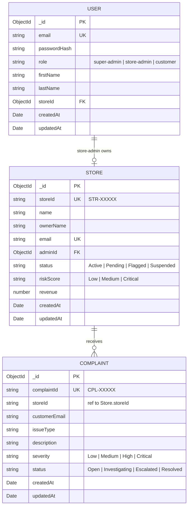
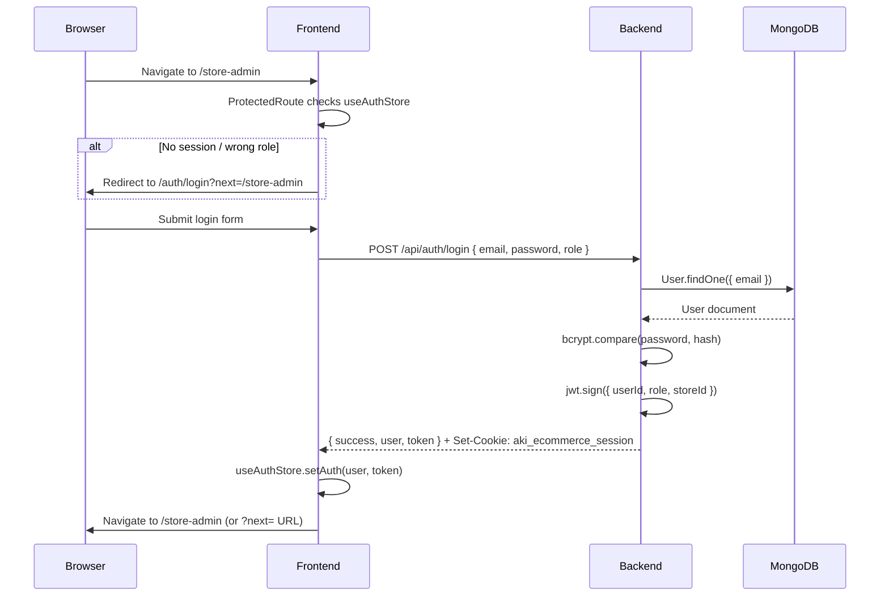
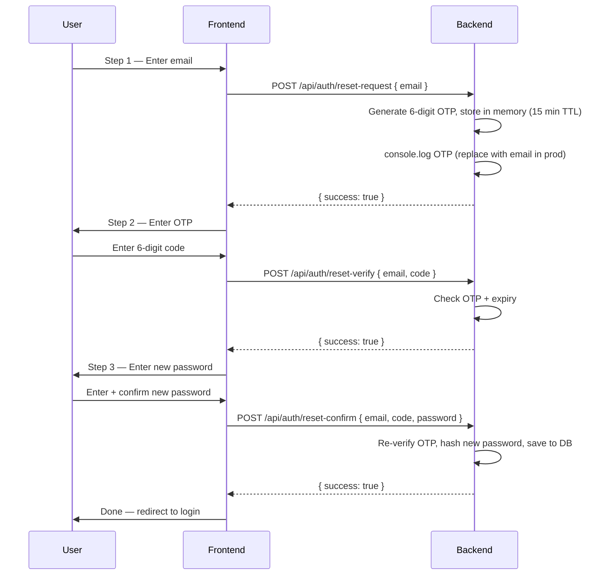

# AKI Commerce — Backend API

> Express + TypeScript REST API powering the AKI Commerce SaaS platform. Connects to MongoDB Atlas and serves the Vite frontend via JWT-authenticated endpoints.

---

## Quick Start

```bash
# 1. Install dependencies
cd backend
npm install

# 2. Add environment variables (see .env.local section below)

# 3. Start development server (auto-restarts on file changes)
npm run dev

# Server runs at: http://localhost:5000
```

---

## Test Login Credentials

> Insert the seed documents from the section below into MongoDB Atlas first, then use these credentials.

| Role        | Email             | Password    | Dashboard                         |
|-------------|-------------------|-------------|-----------------------------------|
| Super Admin | `admin@aki.com`   | `Admin@123` | `http://localhost:5174/super-admin` |
| Store Admin | `store@aki.com`   | `Admin@123` | `http://localhost:5174/store-admin` |

---

## Environment Variables (`.env.local`)

Place this file at the **project root** (`aki-store--2.0/.env.local`):

```env
MONGODB_URI=mongodb+srv://<user>:<password>@<cluster>.mongodb.net/aki-official-database?appName=Cluster0
JWT_SECRET=<your-64-byte-hex-secret>
PORT=5000
NODE_ENV=development
```

Generate a secure JWT secret:
```bash
node -e "console.log(require('crypto').randomBytes(64).toString('hex'))"
```

---

## MongoDB Seed Documents

Paste these in order into MongoDB Atlas (Collections tab → Insert Document).

### Collection: `users`

**Super Admin**
```json
{
  "_id": { "$oid": "69a42724b1c6129521e4b5cc" },
  "email": "admin@aki.com",
  "passwordHash": "$2b$10$w9oq9aFcq0EP6WHc3HUcxubP1YBezePevteYFlFHsG7ezJTADRpEu",
  "role": "super-admin",
  "firstName": "AKI",
  "lastName": "Director",
  "createdAt": { "$date": "2026-03-01T00:00:00.000Z" },
  "updatedAt": { "$date": "2026-03-01T00:00:00.000Z" }
}
```

**Store Admin**
```json
{
  "_id": { "$oid": "69a42724b1c6129521e4b5dd" },
  "email": "store@aki.com",
  "passwordHash": "$2b$10$w9oq9aFcq0EP6WHc3HUcxubP1YBezePevteYFlFHsG7ezJTADRpEu",
  "role": "store-admin",
  "firstName": "Boutique",
  "lastName": "Owner",
  "storeId": { "$oid": "69a42724b1c6129521e4b5ee" },
  "createdAt": { "$date": "2026-03-01T00:00:00.000Z" },
  "updatedAt": { "$date": "2026-03-01T00:00:00.000Z" }
}
```

### Collection: `stores`
```json
{
  "_id": { "$oid": "69a42724b1c6129521e4b5ee" },
  "storeId": "STR-10001",
  "name": "Maison Élite",
  "ownerName": "Boutique Owner",
  "email": "store@aki.com",
  "adminId": { "$oid": "69a42724b1c6129521e4b5dd" },
  "status": "Active",
  "riskScore": "Low",
  "revenue": 0,
  "createdAt": { "$date": "2026-03-01T00:00:00.000Z" },
  "updatedAt": { "$date": "2026-03-01T00:00:00.000Z" }
}
```

### Collection: `complaints`
```json
{
  "_id": { "$oid": "69a42724b1c6129521e4b5ff" },
  "complaintId": "CPL-10001",
  "storeId": "STR-10001",
  "customerEmail": "customer@example.com",
  "issueType": "Delivery",
  "description": "Order not received after 14 days.",
  "severity": "Medium",
  "status": "Open",
  "createdAt": { "$date": "2026-03-01T00:00:00.000Z" },
  "updatedAt": { "$date": "2026-03-01T00:00:00.000Z" }
}
```

> **Insert order matters:** stores → users (store-admin) → complaints
> The `storeId` on the user must point to an existing Store `_id`.

---

## Entity-Relationship (ER) Diagram



---

## API Endpoint Reference

### Auth Routes

| Method | Endpoint                   | Body                                               | Returns                    | Auth |
|--------|----------------------------|----------------------------------------------------|----------------------------|------|
| POST   | `/api/auth/register`       | `email, password, firstName, lastName, storeName`  | `{ success, message }`     | None |
| POST   | `/api/auth/login`          | `email, password, role?`                           | `{ success, user, token }` | None |
| POST   | `/api/auth/logout`         | —                                                  | `{ success }`              | None |
| POST   | `/api/auth/reset-request`  | `email`                                            | `{ success, message }`     | None |
| POST   | `/api/auth/reset-verify`   | `email, code`                                      | `{ success }`              | None |
| POST   | `/api/auth/reset-confirm`  | `email, code, password`                            | `{ success, message }`     | None |

### Super Admin Routes

| Method | Endpoint                       | Body / Params                       | Returns                           |
|--------|--------------------------------|-------------------------------------|-----------------------------------|
| GET    | `/api/super-admin/overview`    | —                                   | `{ activeStores, pendingApprovals, openComplaints, totalRevenue }` |
| GET    | `/api/super-admin/stores`      | —                                   | `Store[]`                         |
| PUT    | `/api/super-admin/stores`      | `storeId, status, riskScore?`       | Updated `Store`                   |
| GET    | `/api/super-admin/complaints`  | —                                   | `Complaint[]`                     |
| PUT    | `/api/super-admin/complaints`  | `complaintId, status, severity?`    | Updated `Complaint`               |

### Store Routes

| Method | Endpoint               | Body                                              | Returns           |
|--------|------------------------|---------------------------------------------------|-------------------|
| POST   | `/api/store/complaints`| `storeId, customerEmail, issueType, description`  | New `Complaint`   |

---

## Authentication & Session Flow



---

## Password Reset Flow



---

## Role Access Matrix

| Route                  | `super-admin` | `store-admin` | Guest |
|------------------------|:---:|:---:|:---:|
| `/`  (landing)         | ✅ | ✅ | ✅ |
| `/explore`             | ✅ | ✅ | ✅ |
| `/auth/login`          | ✅ | ✅ | ✅ |
| `/auth/super-login`    | ✅ | ✅ | ✅ |
| `/super-admin/**`      | ✅ | ❌ → `/auth/super-login` | ❌ |
| `/store-admin/**`      | ❌ → `/super-admin` | ✅ | ❌ → `/auth/login` |

> Enforced client-side by `ProtectedRoute` component. Server-side enforcement can be added via JWT middleware when needed.

---

## Project Structure

```
backend/
├── src/
│   ├── index.ts          ← Express app, all routes registered here
│   ├── lib/
│   │   └── mongodb.ts    ← Mongoose connection with caching
│   ├── models/
│   │   ├── User.ts       ← User schema (super-admin, store-admin, customer)
│   │   ├── Store.ts      ← Store schema (linked to store-admin)
│   │   └── Complaint.ts  ← Complaint/dispute schema
│   └── services/
│       ├── auth.service.ts       ← Register, login, password reset logic
│       ├── store.service.ts      ← Store CRUD + integrity management
│       └── complaint.service.ts  ← Complaint dispatch + status updates
├── package.json
└── tsconfig.json
```

---

## Development Scripts

```bash
npm run dev     # Start with nodemon (auto-restart on change)
npm run build   # Compile TypeScript to /dist
npm start       # Run compiled /dist/index.js (run build first)
```

---

## Production Notes

- Replace the **in-memory OTP store** in `auth.service.ts` with a DB-backed token collection and integrate an email provider (Resend / Nodemailer / SendGrid) for the password reset flow.
- Add **JWT middleware** to protect sensitive super-admin routes server-side.
- Set `NODE_ENV=production` and ensure `CORS` origin only allows your deployed frontend domain.
- Use **MongoDB Atlas IP Whitelist** to restrict database access to your server IP only.
